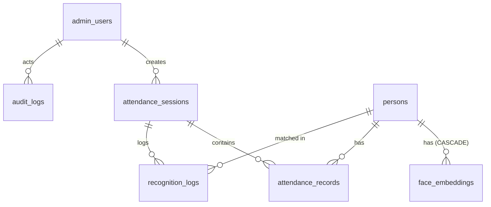

# Database design (Phase 3)

Eight tables in SQLite via Flask-SQLAlchemy, migrated with Flask-Migrate
(Alembic). Naming note: the phase plan's *Admin / Student / Attendance /
Settings* map to `admin_users` / `persons` / `attendance_sessions` +
`attendance_records` / `settings`. "Person" was chosen over "Student" so the
same schema serves classrooms, offices, and events without a rename;
"Attendance" is split into two tables because a mark only means something
*relative to a session* (see below).

## Entity map

## Per-table decisions

### admin_users (login accounts)
- **Separate from persons.** Enrollees never log in; admins are never
  recognised. Merging the two invites privilege mistakes.
- **Role as a ranked string** (`viewer < operator < admin`) with a
  `CheckConstraint`, not a roles table: three fixed roles don't justify a
  join, and `has_role()` gives hierarchical checks in one place.
- **`is_active` shadows `UserMixin.is_active` deliberately** — Flask-Login
  reads it to block disabled accounts at login, so deactivation needs no
  extra code.
- **Passwords via werkzeug hashes** (salted, per-hash parameters embedded);
  the plaintext column never exists.
- Validators normalise usernames to lowercase at assignment so uniqueness
  can't be dodged by case.

### persons (enrollees)
- **`code` is the external identity** (roll number / employee ID), unique
  and indexed — humans key on it, so the API and UI do too. The integer PK
  stays internal so codes can be corrected without breaking FKs.
- **`thumbnail` is UI-only.** The avatar JPEG lives here, but recognition
  reads only `face_embeddings` — deleting embeddings genuinely deletes the
  biometric data.
- **`enrolled_at` doubles as the enrollment flag** (NULL = not enrolled):
  one column gives both the boolean and the audit timestamp.
- **`is_active` soft-delete** keeps attendance history intact when someone
  leaves; the matcher excludes inactive persons at gallery load.
- `group_name` is free-form and indexed for report filtering; a groups table
  would be premature for a single-tenant deployment.

### face_embeddings (biometric templates)
- **Raw float32 bytes in a `LargeBinary(2048)`**, not JSON or a vector
  extension: 512 × 4 bytes round-trips losslessly through
  `set_vector`/`get_vector`, and at this scale (thousands of rows) brute-force
  cosine in NumPy beats the operational cost of a vector DB.
- **Vectors are L2-normalised on write** so cosine similarity downstream is a
  plain dot product; `set_vector` rejects wrong shapes and zero/non-finite
  norms so a corrupt vector can never enter the gallery.
- **Samples + one centroid per person** (`is_centroid`): the matcher loads
  only centroids (N rows, not N×10); samples are retained for threshold
  calibration and future re-averaging.
- **`model_name` on every row** because embeddings from different model packs
  live in incompatible spaces; the matcher filters on the active pack, which
  makes model upgrades a re-enroll-in-place operation instead of a schema
  change.
- **`ON DELETE CASCADE` + `passive_deletes`**: deleting a person purges their
  biometrics at the DB level — privacy compliance doesn't depend on
  application code remembering to clean up. (SQLite needs
  `PRAGMA foreign_keys=ON`, applied per-connection in `app/extensions.py`.)

### attendance_sessions + attendance_records (the "Attendance" pair)
- **Two tables, not one:** a mark is meaningless without a scope. Sessions
  define the scope (name, date, late cutoff, open/closed); records are the
  facts inside it. One flat table would duplicate session metadata onto
  every mark.
- **`UNIQUE(session_id, person_id)` is the duplicate-suppression mechanism.**
  A kiosk sends frames every 2.5 s, so "already marked" is the common race;
  the constraint makes the DB the arbiter, and the service layer inserts
  under a savepoint and treats `IntegrityError` as "lost the race, fetch the
  winner".
- **`late_after` is a precomputed instant**, not "minutes" — the comparison
  at mark time is a single `now > late_after` with no recomputed arithmetic
  to drift.
- **`status` (`present`/`late`/`manual`) + `confidence` + `marked_by`** keep
  the provenance of every mark: automatic marks carry the similarity score,
  manual corrections carry the admin's username and NULL confidence.
- **`UNIQUE(name, session_date)`** lets "Morning Lecture" recur daily while
  preventing two identical sessions on the same day.
- Composite index `(person_id, marked_at)` serves per-person history queries;
  the unique constraint's index leads with `session_id` and can't.

### audit_logs + recognition_logs
- **Two logs with different lifecycles.** `audit_logs` answers "who did
  what" (logins, enrollments, corrections) and is kept long-term;
  `recognition_logs` records *every* match attempt with its similarity for
  threshold calibration and grows fastest, so it is designed to be pruned by
  a retention job without touching the audit trail.
- **Audit rows are staged, not committed, by `record_audit`** — they commit
  atomically with the action they describe, so the trail can never claim
  something happened that rolled back.
- **`details` is a JSON text column**, not normalised: audit context is
  written once, read rarely, and shaped differently per action.
- `recognition_logs.person_id` is nullable — "unknown face" is a legitimate,
  loggable outcome. Indexes on `created_at` (pruning, dashboards),
  `session_id` (per-session calibration), `audit_logs.action` (filtering).

### settings (runtime knobs)
- **Key/value strings in the DB**, seeded from `Config.DEFAULT_SETTINGS` by
  `flask init-db`: recognition thresholds must be tunable by an operator at
  runtime, not baked into a redeploy. Typed accessors (`get_float`,
  `get_int`) fall back to defaults on bad values instead of crashing the
  request path.

## Cross-cutting decisions

- **Naive UTC everywhere** (`utcnow()` helper): SQLite has no tz-aware type;
  storing one canonical zone and converting at presentation avoids silent
  mixed-zone comparisons.
- **Validation in two layers.** SQLAlchemy `@validates` hooks fire on
  assignment with clear `ValueError`s (and normalise: emails lowercased,
  usernames lowercased, strings trimmed); DB constraints
  (`CheckConstraint`s, uniques, FKs) are the tamper-proof backstop for
  anything that slips past application code. Bounded checks catch scale
  bugs: `confidence ∈ [-1, 1]` (cosine), `quality_score ∈ [0, 1]`
  (detector confidence).
- **SQLite pragmas per connection**: WAL (readers don't block kiosk writes)
  and `foreign_keys=ON` (FK enforcement is off by default in SQLite).
- **Migrations**: Flask-Migrate initialised with `render_as_batch=True`
  because SQLite can't ALTER in place — batch mode rebuilds via a temp
  table. History: `ca08227f1e27` (baseline, generated against an empty DB so
  fresh installs build purely from migrations) → `ab8b30513d68` (history
  indexes). Existing DBs were `db stamp`ed at baseline. Workflow:
  `flask --app run.py db migrate -m "..."` → review → `db upgrade`.
